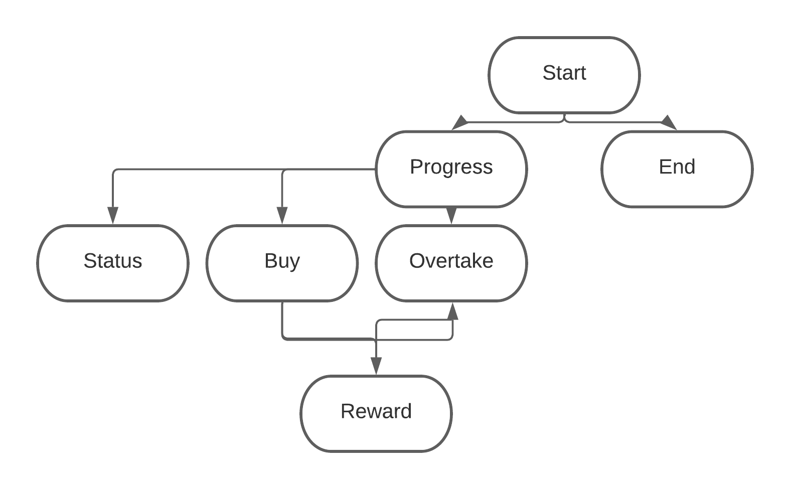

# Architecture technique

## 1. Architecture demandée

L'architecture demandée pour le projet est le modèle `MVC` (Modèle-Vue-Contrôleur). Le modèle `MVC` est un modèle d'architecture logicielle destiné aux interfaces graphiques. Il est utilisé pour le développement d'applications et repose sur la séparation du traitement des données (Modèle), de l'interface de l'utilisateur (Vue) et de la logique de contrôle destinée à la liaison entre les deux autres couches (Contrôleur).

## 2. Mise en place

## 2.1. Contrôleurs

> Voici un diagramme logique des contrôleurs montrant comment ces derniers sont liés et s'appellent entre eux :

Un enum permettant de définir les différents états du jeu est également présent dans le package `controller` : `GameMode`.
Il représente le mode de jeu choisi (avec l'interface graphique ou dans la console).

# 2.2. Modèles

> En ce qui concerne la couche "modèle", on a décidé de séparer les différents objets du jeu de cette manière :

- `Cell` : objet représentant une cellule du plateau de jeu (le `TimeBoard`).
- `TimeBoard` : objet représentant le plateau de jeu (le plateau du temps où les pions chronos avancent).
- `Player` : objet représentant un joueur du jeu.
- `PlayerBoard` : objet représentant le plateau de jeu d'un joueur (celui où il pose ses pièces).
- `Piece` : objet représentant une pièce du jeu.
- `PieceSet` : objet représentant un ensemble des pièces disponibles dans le jeu et traite les pièces disponibles à chaque étape.
- `PieceSetFactory` : objet dédié à la création d'un `PieceSet` à partir d'un fichier de configuration (pieces.txt).

# 2.3. Vues

> La couche "vue" est séparée en deux interfaces : `GUIView` et `ConsoleView`. 

- Lorsque l'utilisateur choisit le mode d'affichage "GUI" (Graphical User Interface), on appelera les méthodes statiques de `GUIView` qui utilisent la librairie Zen5 pour affichage graphique du jeu. 
- Lorsque l'utilisateur choisit le mode d'affichage "Console", on appelera les méthodes statiques de `ConsoleView` qui n'utilisent pas de librairie graphique et affichent le jeu directement dans la console.

